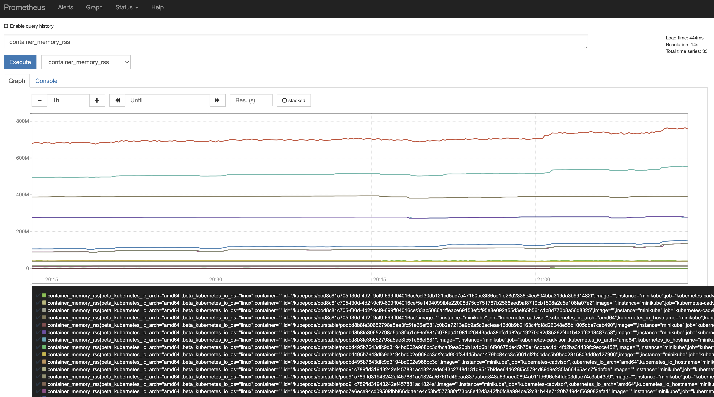
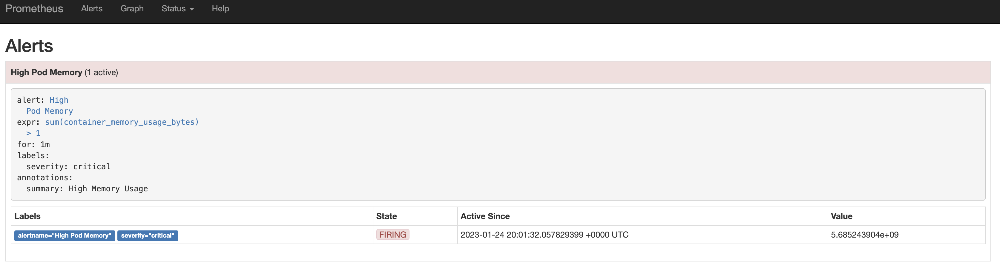
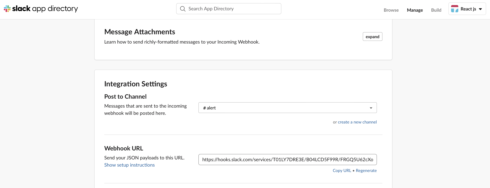
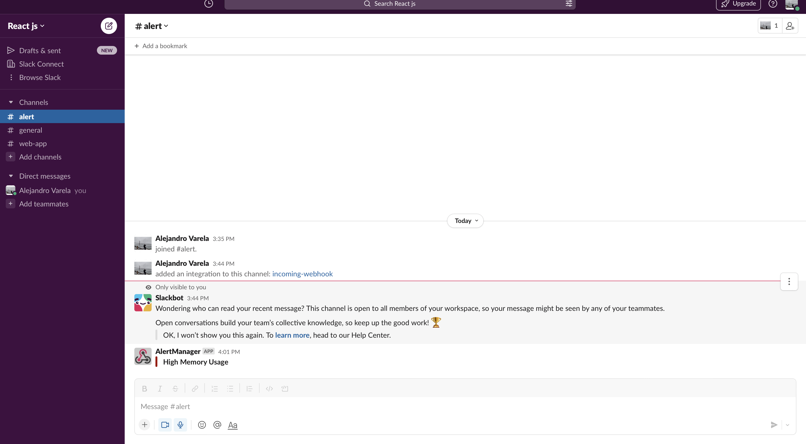
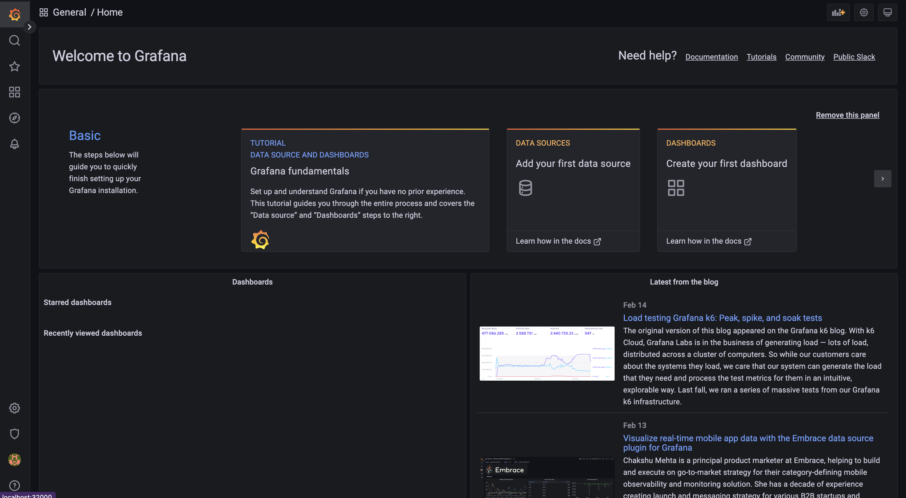
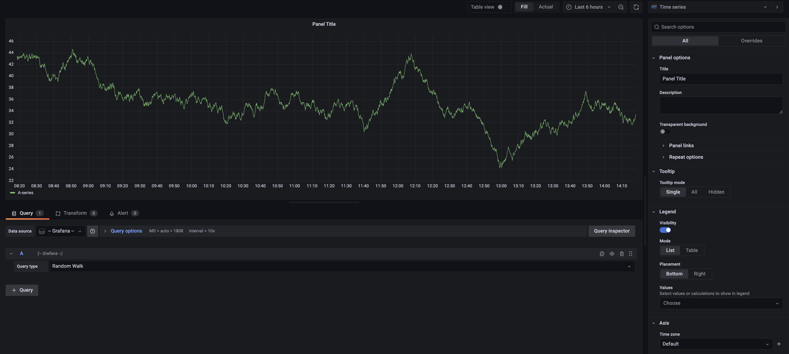
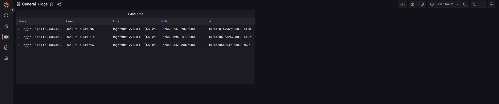
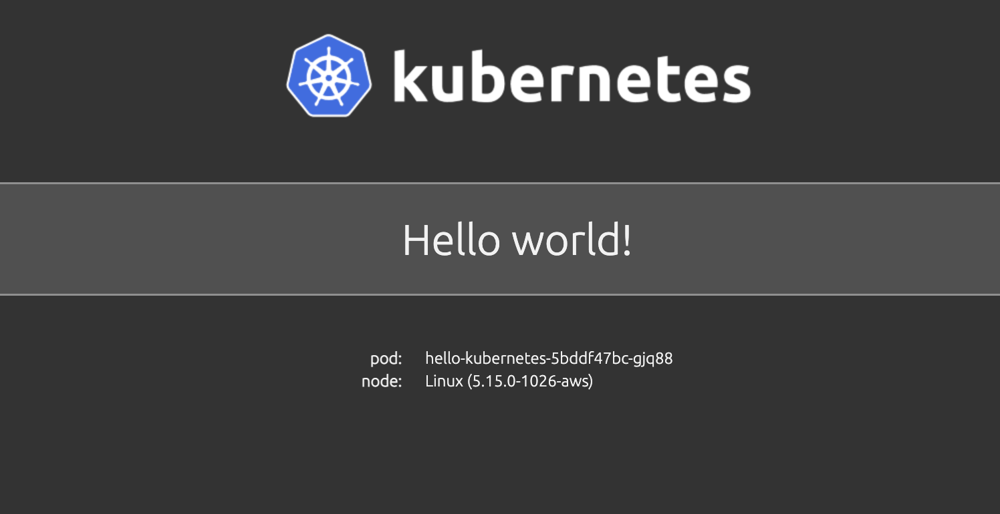

# Kubernetes Course 🫰

In this course we will manage some basic concepts about container orchestation tool.

## Minikube configuration 🍷

Minikube is local Kubernetes, focusing on making it easy to learn and develop for Kubernetes. All you need is Docker (or similarly compatible) container or a Virtual Machine environment

## Installation 🐙

To install the latest minikube stable release on x86-64 Linux using binary download. Check the following link on case of diferent machine architecture https://minikube.sigs.k8s.io/docs/start/

```
curl -LO https://storage.googleapis.com/minikube/releases/latest/minikube-linux-amd64
sudo install minikube-linux-amd64 /usr/local/bin/minikube
```

## Machine minimum resources 🎁

- 2 CPUs or more
- 2GB of free memory
- 20GB of free disk space
- Internet connection
- Container or virtual machine manager, such as: Docker, QEMU, Hyperkit, Hyper-V, KVM, Parallels, Podman, VirtualBox, or VMware Fusion/Workstation

## Start your cluster 🚀

```
minikube start
```

## Finish your kubernetes services ✝️

```yaml
kubectl delete all --all
## From an especific namespace
kubectl delete all --all -n namespace
```

## 1- Monitoring and notifications to an Slack channel 🎠

Prometheus server is responsible for send alerts of monitoring to the alert manager and this one is in charge to alert to our different integrations suach send email or slack etc.

The first file is our namespace that are a way to organize clusters into virtual sub-clusters. (1-monitoring/namespaces.yaml)

```yaml
kubectl appliy -f namespace.yaml
# namespace/monitoring created ✅
```

### Prometheus Pod  🚂

Then we must create some role or permissions in that monitoring subcluster that we have already created. This with the objective that prometheus can access to system files such as **extract metrics**.

```yaml
kubectl apply -f prometheus-cluster-role.yaml
#clusterrole.rbac.authorization.k8s.io/prometheus created ✅
#clusterrolebinding.rbac.authorization.k8s.io/prometheus created ✅
```

Also, we need to deploy our prometheus pod server that it will create our container instance base on the following image **prom/prometheus:v2.1.0** in ``monitoring``namespace and it will attach some config and storage volume in the root cluster.

```
kubectl apply -f prometheus-cluster-role.yaml
deployment.apps/prometheus-deployment created ✅
```

Check what we have at this moment:

```
kubectl -n monitoring get all
```

|NAME                                  | READY|   STATUS           |RESTARTS|   AGE|
|-------------------------------------|------|--------------------|--------|------|
|pod/prometheus-deployment-5875b79765-nzpjp|   0/1|     ContainerCreating|   0|          2m31s|
|deployment.apps/prometheus-deployment|   0/1|     1|           0|          2m31s|
|replicaset.apps/prometheus-deployment-5875b79765|   1|         1|         0|       2m31s|


*Config maps* are manifiest that you inject to an specific namespace and then whatever container running on this ns can read those configuration maps and generated its configuration base on that template (Global Enviroment Namespaces)

**Basic Check of Memory Use**
```yaml
rules:
      - alert: High Pod Memory
        expr: sum(container_memory_usage_bytes) > 1
        for: 1m
        labels:
          severity: critical
        annotations:
          summary: High Memory Usage
```

Applying Map Configuration:

```
kubectl apply -f prometheus-configmap.yaml
configmap/prometheus-server-conf created ✅
```

Creation of a service to expose our prometheus pods using a node port that basically open a port in the workers nodes that redirects the traffic to the pod with specific label or selector.

```
kubectl apply -f prometheus-service.yaml 
service/prometheus-service created ✅
```

### Alert Manager Pod 🪝

- Service creation (Cluster Ip because we want that prometheus can access to that container assigning an specific ip in the cluster)

    ```
    kubectl apply -f alert-manager-service.yaml
    service/alertmanager created ✅
    ```

- Deployment in this case we have a pod that will have two containers, the firts one is the alert manager and the second one a **side car** that will be watching for changes in global config map. Also, we have a Persistent Volume Claim that is a request for storage by a user. It is similar to a Pod. Pods consume node resources and PVCs consume PV resources, claims can request specific size and access modes.

    ```
    kubectl apply -f alert-manager-configmap.yaml 
    service/alertmanager created ✅

    kubectl apply -f alert-manager-pvc.yaml 
    persistentvolumeclaim/alertmanager created ✅

    kubectl apply -f alert-manager-deployment.yaml 
    deployment.apps/alertmanager created ✅
    ```

### Checking all infrastructure 🏗️

- Pods

|NAME                                  | READY|   STATUS           |RESTARTS|   AGE|
|-------------------------------------|------|--------------------|--------|------|
|pod/alertmanager-85bc4f4759-s25c5|            2/2|     Running|   0|         23m|
|pod/prometheus-deployment-5875b79765-nzpjp|   1/1|     Running|   0|         91m|

- Services

|NAME                         |TYPE        |CLUSTER-IP |    EXTERNAL-IP|   PORT(S)|          AGE|
|-------------------------------------|------|--------------------|--------|------|--------------|
|service/alertmanager|         ClusterIP|   10.110.82.83|   <none>|        9093/TCP|         59m|
|service/prometheus-service|   NodePort|    10.100.0.75|    <none> |       8080:30000/TCP|   79m|

- Deployments

|NAME                                  |  READY  | UP-TO-DATE |  AVAILABLE |  AGE|
|-------------------------------------|------|--------------------|--------|------|
|deployment.apps/alertmanager|            1/1 |    1    |        1   |        23m|
|deployment.apps/prometheus-deployment|   1/1 |    1  |          1  |         91m|

### Considerations 🚦

Due to we are using minikube for our local kubernetes cluster we just have one node and for accesing externally we must use the following command:

```bash
minikube -n monitoring service prometheus-service --url
http://192.168.49.2:30000 ⚠️
```

However i have my minikube configuration inside an ec2 vm hosted in aws cloud provider 😅. That is why i must port forward my vm local entry set in 31000 port and the service port 8080 of the prometheus node port:

```bash
kubectl port-forward --address 0.0.0.0 service/prometheus-service --namespace monitoring 31000:8080
Forwarding from 0.0.0.0:31000 -> 9090
Handling connection for 31000
```

### Evidences 🚧









## 2- Liveness and Readiness 🎠

Main concept is kubernetes knowledge of your pod liveness. Also,

## 3- Logging using grafana and loki 📌

Loki is a log database developed by Grafana Labs. In this repo we will deploy Loki on a Kubernetes cluster, and we will use it to monitor the log of our pods.

### Deployment of app service

```yaml
kubectl apply -f app.yaml
```

2. Port forward service from 30000:80

```yaml
kubectl port-forward --address 0.0.0.0 service/hello-kubernetes 30000:80
```

### Deployment of grafana service

Grafana is an open source interactive data-visualization platform, developed by Grafana Labs, which allows users to see their data via charts and graphs that are unified into one dashboard (or multiple dashboards!) for easier interpretation and understanding.

1. Apply yaml files using kustomize

```yaml
kubectl apply -k .
```

2. Port forward service from 31000:80

```yaml
kubectl port-forward --address 0.0.0.0 service/grafana-service 31000:80
```

3. Authentication credentials

Username: admin
Password: admin

### Deployment of loki service 

**Definition:**
Loki is a log aggregation system designed to store and query logs from all your applications and infrastructure.

Another concept to have in mind is a fully qualified domain name (FQDN) that is the complete address of an internet host or computer. It provides its exact location within the domain name system (DNS) by specifying the hostname, domain name and top-level domain (TLD).

**Contextualization:**
Loki is a great database that is easy to create and the only thing we will do is describe that it will need a volume so that it is persistent between service drops (pod)


1. Apply all YAML files in order and wait

```yaml
kubectl apply -k .
```

2. Remember the FQDN
```bash
http://loki-service.kube-logging.svc.cluster.local:3100
```

### Deployment of fluentd service

Service capable of monitoring the system logs and processing it in the way that we tell it in this case for loki, we will use **daemon set** to deploy a copy of fluentd in each of the nodes to centralize this information in the loki database to view them in grafana.

Using **configmap** to grab the logs and insert them into loki, for this a fluentd configuration is injected into its container, here we tell you where those logs are, how we parse that information (automation core)

1. Apply all YAML files in order and wait

```yaml
kubectl apply -k .
```

### Evidences 🚧








